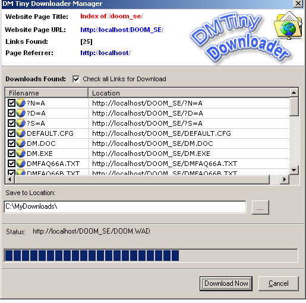



## DM DownloadMgr

### Description

This example adds a menu to IE when you right click on a webpage to download links just as DAP does and lists all the files in a listview control.

You can use this code to add to your own download accelerators. This example does download files but

Does not support resume as this was only an example

I have also included a Readme text file to show you how to get the project working.
 
### More Info
 

             |
---                |---
**Submitted On**   |2001-07-27 01:39:54
**By**             |[dreamvb](https://github.com/Planet-Source-Code/PSCIndex/blob/master/ByAuthor/dreamvb.md)
**Level**          |Beginner
**User Rating**    |4.3 (26 globes from 6 users)
**Compatibility**  |VB 6\.0
**Category**       |[Internet/ HTML](https://github.com/Planet-Source-Code/PSCIndex/blob/master/ByCategory/internet-html__1-34.md)
**World**          |[Visual Basic](https://github.com/Planet-Source-Code/PSCIndex/blob/master/ByWorld/visual-basic.md)
**Archive File**   |[DM\_Downloa1774297252004\.zip](https://github.com/Planet-Source-Code/dreamvb-dm-downloadmgr__1-55181/archive/master.zip)

